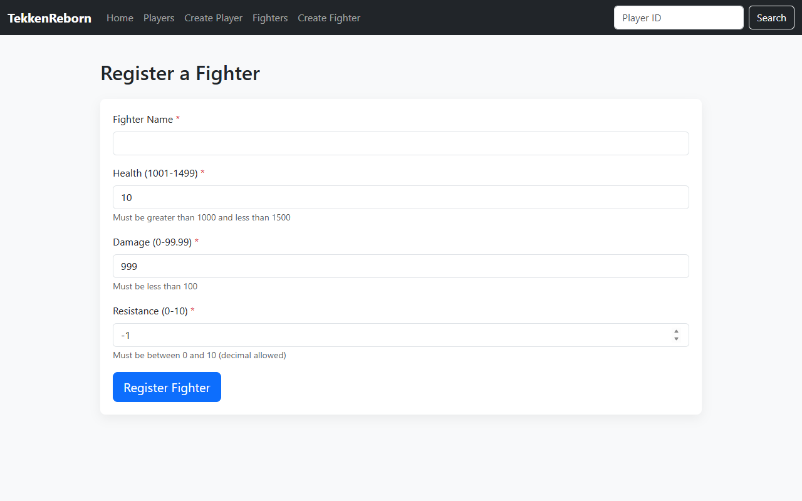
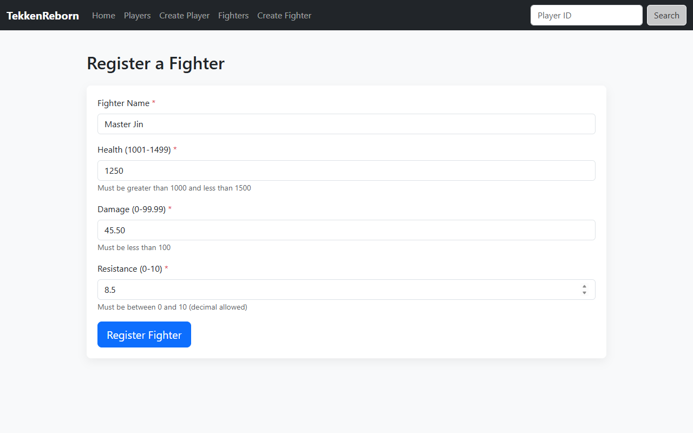
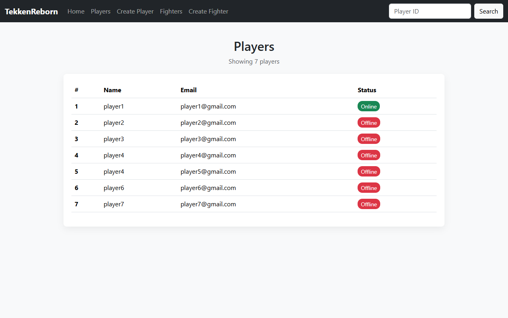

# Lab 3 - Intro to Spring Data JPA (Refactoring our Lab2 Backend with DB Connectivity)

## Course Information

* **Course:** CPAN 228
* **Topic:** Persisting Data with Spring Data JPA & Repository Pattern 

---

## Overview

In the previous lab you built a `Fighter` registration form and stored fighters in a plain Java `List`. The problem with that approach is that all data disappears the moment the server restarts. In this lab you will connect your application to a real database using **Spring Data JPA**, so fighters are persisted permanently.

---

## Getting Started

### GitHub Setup

1. **Fork the Repository**
   - Go to the repository on GitHub and click the **Fork** button in the top-right corner

2. **Clone Your Fork**
   ```bash
   git clone https://github.com/YOUR-USERNAME/Week-6-Intro-to-Spring-Data-JPA.git
   cd Week-6-Intro-to-Spring-Data-JPA
   ```

3. **Add Upstream Remote**
   ```bash
   git remote add upstream https://github.com/Christin-Classrooms/Week-6-Intro-to-Spring-Data-JPA.git
   ```

4. **Pull Latest Changes**
   ```bash
   git pull upstream main
   ```

5. **Create a Feature Branch**
   ```bash
   git checkout -b feature/lab3-yourname
   ```
   Replace `yourname` with your actual name (e.g., `feature/lab3-john-doe`)

---

## Lab 3 Assignment

### Part 1 — Annotate the Fighter Entity

Your `Fighter` class already has all its fields. Your job is to turn it into a proper **JPA Entity** so Hibernate can map it to a database table automatically.

**Requirements:**
- Annotate the class so JPA recognizes it as an entity
- Add a primary key `id` field that auto-increments
- Keep all existing fields and validation annotations from the previous lab
- Look at how we implemented it in Player Class
---

### Part 2 — Create the FighterRepository

Create a `FighterRepository` interface inside a `repository` package. By extending `JpaRepository` you get the following methods generated for you automatically — no implementation needed:

| Method | What it does |
|---|---|
| `save(fighter)` | INSERT or UPDATE a fighter |
| `findById(id)` | SELECT a single fighter by ID |
| `findAll()` | SELECT all fighters |
| `deleteById(id)` | DELETE a fighter by ID |
| `count()` | COUNT total fighters |
| `existsById(id)` | Check if a fighter exists |

implements all of these methods in the `FighterService` class

---


### Part 3 — Refractor `FighterController` and `CreateFighterController` to use the new source of data

No need to add methods we didn't have before.

---

### Thymeleaf templates

No need to update Thymeleaf templates, we're just refractoring the back end.

---

## Validation Requirements (unchanged from Lab 2)

| Field | Rule |
|---|---|
| `name` | Required, not blank |
| `health` | Must be > 1000 and < 1500 |
| `damage` | Must be < 100 |
| `resistance` | Must be between 0.0 and 10.0 (double) |

---

## Testing Your Work

Before submitting, verify each of the following manually:

1. **Create** — Submit the form with valid data and confirm the fighter appears in the list
2. **Create (invalid)** — Submit with bad data and confirm errors appear and nothing is saved
3. **Read** — Navigate to the fighters list and confirm all saved fighters appear
   
### Lab 3 Screenshots

#### 1. Invalid Data Submission
**Before (Invalid Data Entered):**


**After (Validation Errors Displayed):**


#### 2. Valid Data Submission
**Before (Valid Data Entered):**


**After (Successfully Added to Roster):**


---

## Development Workflow

```bash
# Run the app
mvn spring-boot:run

# Commit your changes
git add .
git commit -m "Lab 3: Implement FighterRepository with full CRUD"

# Push to your fork
git push origin feature/lab3-yourname
```

Then open a Pull Request and submit the link on BlackBoard.

---

## Resources

* [Thymeleaf Cheat Sheet](THYMELEAF_CHEATSHEET.md)
* [Spring Data JPA Docs](https://spring.io/projects/spring-data-jpa)
* [Spring Boot Reference — Data](https://docs.spring.io/spring-boot/docs/current/reference/html/data.html)
